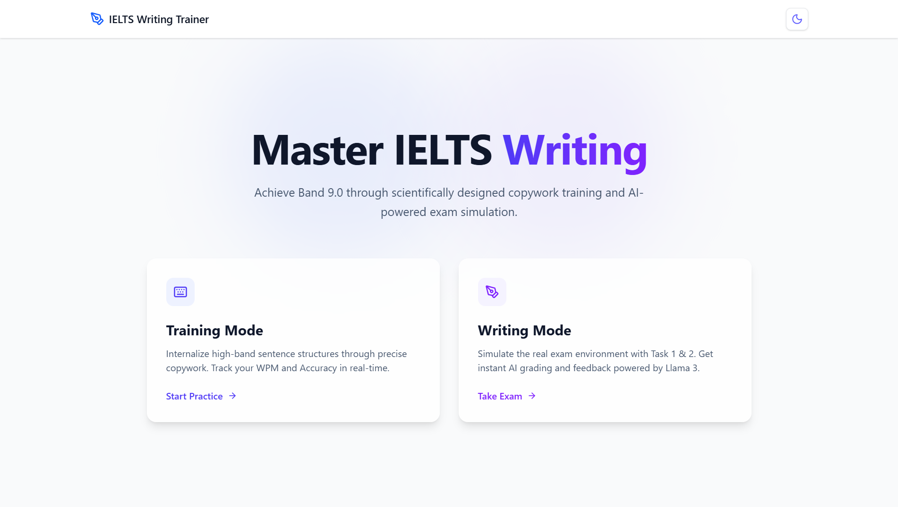
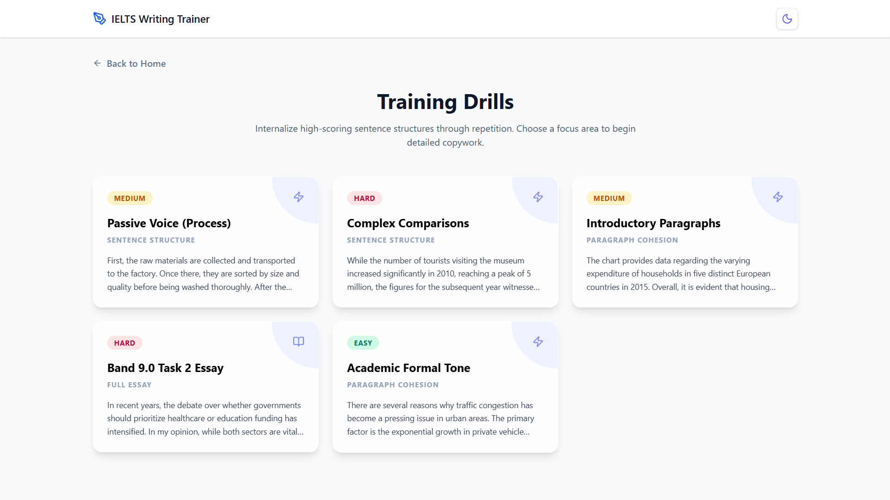
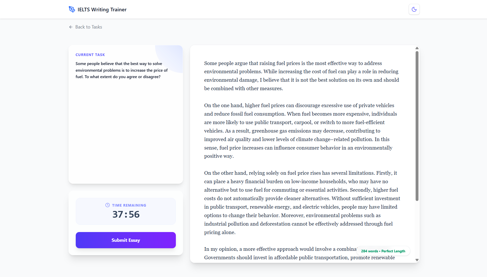
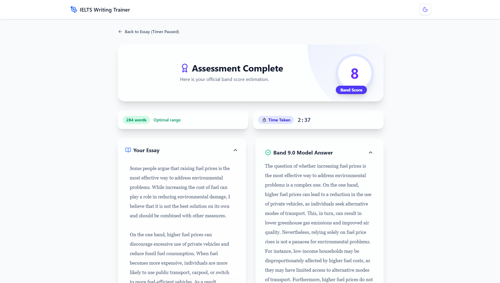

# IELTS Writing Trainer ✍️

Achieve your target IELTS score with a scientifically designed training platform focusing on high-band copywork and AI-powered exam simulations.

## 🚀 Key Features

### 1. Training Mode (Copywork)
Internalize Band 9.0 sentence structures and vocabulary through precise copywork training.
- **Real-time Tracking**: Monitor your Word Per Minute (WPM) and Accuracy.
- **Scientific Approach**: Copywork helps build muscle memory for academic writing patterns.
- **Diverse Library**: Practice with Bar Charts, Maps, Processes, and Task 2 Essays.

### 2. Writing Mode (Simulated Exam)
Experience the real IELTS exam environment for both Task 1 and Task 2.
- **Task 1**: Analyze graphs, charts, and diagrams with a 20-minute timer.
- **Task 2**: Write comprehensive essays on diverse topics with a 40-minute timer.
- **Interactive Interface**: Seamlessly toggle between task instructions and your editor.

### 3. AI Examiner (Powered by Groq & Llama 3)
Get instant, professional feedback on your submissions.
- **Detailed Evaluation**: Get scores for Task Achievement, Coherence & Cohesion, Lexical Resource, and Grammatical Range.
- **Band 9 Model Answers**: Study high-quality model answers generated specifically for your task.
- **Actionable Tips**: Receive personalized advice on how to improve your score.

---

## 📸 Screenshots

### 🏠 Stunning User Interface
The application features a modern, clean, and responsive design with both Light and Dark mode support.



### ⌨️ Training Mode
Master high-band sentence structures through focused copywork drills.

| 📚 Drill Library | ✍️ Active Practice |
| :---: | :---: |
|  |  |

### 📝 Writing Exam Simulation
Experience a professional exam environment for Task 1 and Task 2.

| ⏱️ Exam Interface | 🤖 AI Feedback & Scoring |
| :---: | :---: |
|  |  |

---

## 🛠️ Tech Stack

- **Framework**: [Next.js](https://nextjs.org/) (App Router)
- **Language**: [TypeScript](https://www.typescriptlang.org/)
- **Styling**: [Tailwind CSS 4](https://tailwindcss.com/)
- **AI Engine**: [Groq SDK](https://groq.com/) using `Llama 3.3 70B`
- **Animations**: [Framer Motion](https://www.framer.com/motion/)
- **Icons**: [Lucide React](https://lucide.dev/)

---

## ⚙️ Setup Instructions

### 1. Clone the repository
```bash
git clone https://github.com/OmarKayali/IELTS_Writing_trainer.git
cd IELTS_Writing_trainer
```

### 2. Install dependencies
```bash
npm install
```

### 3. Environment Variables
Create a `.env.local` file in the root directory and add your Groq API Key:
```env
GROQ_API_KEY=your_api_key_here
```

### 4. Run the development server
```bash
npm run dev
```
Open [http://localhost:3000](http://localhost:3000) to view the app.

---

## 📄 License
This project is private and intended for personal training.
